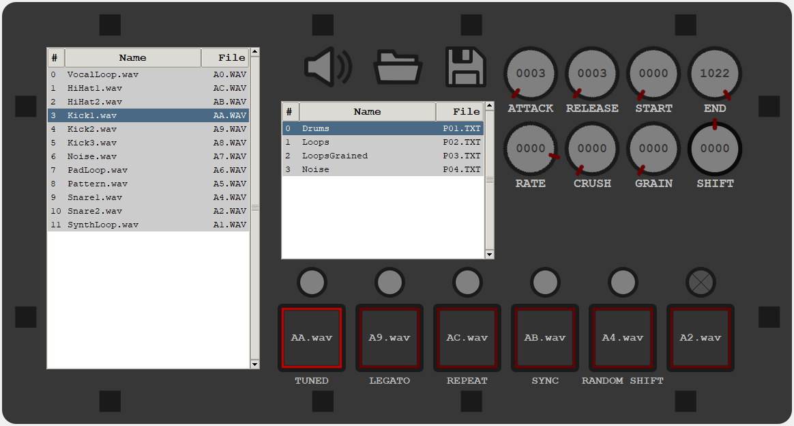

# MicroGranny Organicer

Use this tool to manage the sample-files on your MicroGranny from Bastl Instruments.

## How to use exe

Download the complete content of the dist-directory and run the exe inside.
Exe might be detected as not trustworthy, since I don't have any certificates for it.

## How to run from python

Install python 3.10
run MG_Organicer.py

## About MicroGranny

For more infos of the device this tool is made for, check Bastl Instruments Website:
https://bastl-instruments.com/instruments/microgranny/
